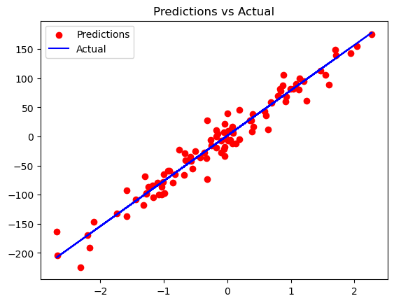

# Simple Linear Regression from Scratch

## Overview
This project implements Simple Linear Regression (SLR) from scratch using Python. It leverages NumPy for matrix operations and uses gradient descent to optimize the regression parameters. Additionally, it employs Scikit-Learn for dataset creation, data splitting, and error evaluation, along with Matplotlib for visualization.

## Table of Contents
- [Introduction](#introduction)
- [Mathematical Formulation](#mathematical-formulation)
- [Dataset](#dataset)
- [Implementation](#implementation)
- [Usage](#usage)
- [Results](#results)
- [Limitations](#limitations)
- [Future Improvements](#future-improvements)
- [References](#references)

## Introduction
Simple Linear Regression is a statistical method that models the relationship between two continuous variables: an independent variable (predictor) and a dependent variable (response). The model assumes a linear relationship:

\[ y = mX + b \]

Where:
- \( y \) is the dependent variable
- \( X \) is the independent variable
- \( m \) (slope) and \( b \) (intercept) are the parameters of the model

This project manually computes \( m \) and \( b \) using gradient descent optimization.

## Mathematical Formulation
The parameters \( m \) and \( b \) are updated iteratively using gradient descent:

\[ m = m - \alpha \frac{1}{n} \sum_{i=1}^{n} X_i (X_i m + b - Y_i) \]

\[ b = b - \alpha \frac{1}{n} \sum_{i=1}^{n} (X_i m + b - Y_i) \]

Where:
- \( \alpha \) is the learning rate.
- \( n \) is the number of samples.

## Dataset
The dataset is generated synthetically using Scikit-Learn's `make_regression` function with:
- 500 samples
- 1 feature
- Noise level of 15 for realistic variability
- random_state = 6666 (random input) for reproducibility

Data is split into training and testing sets using an 80-20 ratio.

## Implementation
The implementation consists of:
1. Generating the dataset using `make_regression()`.
2. Splitting the dataset into training and testing sets using `train_test_split()`.
3. Defining the `LinearRegression` class with:
   - `__init__()` to initialize learning rate and iterations.
   - `fit()` to optimize weights using gradient descent.
   - `predict()` to make predictions on new data.
4. Training the model on the dataset.
5. Evaluating the model using Mean Squared Error (MSE).
6. Visualizing the regression results using Matplotlib.

### Dependencies
The project requires:
```python
import numpy as np
import matplotlib.pyplot as plt
import seaborn as sns
from sklearn.datasets import make_regression
from sklearn.model_selection import train_test_split
from sklearn.metrics import mean_squared_error
```

## Usage
### Running the Code
To run the implementation, execute:
```bash
python slr.py
```

### Sample Output
```
Mean Squared Error: 334.50116441729455
Weights: 77.82991201072505
Bias: 1.568253904841114
```

### Visualizing the Model
The script generates:
- A scatter plot of the training and testing datasets.
- A regression line overlaid on the test data.

```python
plt.scatter(x_test, y_test, color='red')
plt.plot(x_test, predictions, color='blue')
plt.legend(['Predictions', 'Actual'])
plt.title('Predictions vs Actual')
plt.show()
```

## Results
- The model successfully fits a straight line through the data.
- Performance is evaluated using:
  - Mean Squared Error (MSE)



## Limitations
- Assumes a linear relationship between variables.
- Sensitive to outliers.
- Requires proper tuning of the learning rate.

## Future Improvements
- Implement feature scaling for better convergence.
- Extend to Multiple Linear Regression.
- Optimize with more advanced optimization techniques.

## References
- "An Introduction to Statistical Learning" – Gareth James, et al.
- https://en.wikipedia.org/wiki/Simple_linear_regression

